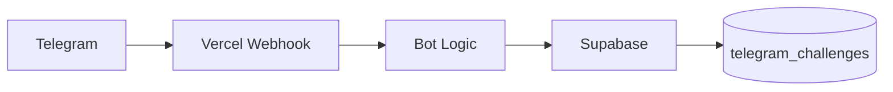

<div align="center">

# 💸 Telegram Earnings Bot

### A tiny Telegram challenge tracker: 2,000 MDL in 180 minutes

Track earnings in real time, see progress toward the target, and persist the challenge state in Supabase.


</div>

---

## 🎯 Challenge

The bot tracks a simple target:

```text
Target: 2,000 MDL
Time:   180 minutes
```

Send an amount to the bot and it is added to the current total.

Examples:

```text
150
75.50
75,50
```

## 🤖 Commands

| Command | Action |
|---|---|
| `/start` | Start a new 180-minute challenge |
| `/status` | Show current progress |
| `/reset` | Reset the challenge |
| `<positive number>` | Add earnings to the current total |

## 📊 Calculation rule

The bot uses the following share logic:

- up to **1,500 MDL inclusive** → shows **30%** of the total earned;
- above **1,500 MDL** → shows **50%**.

## 🧱 Architecture



The project is intentionally small: Node.js serverless handlers receive Telegram webhook requests and store the active challenge state in Supabase.

## 🗄 Database

Create the challenge table:

```sql
create table if not exists public.telegram_challenges (
  telegram_user_id bigint primary key,
  earned numeric(12,2) not null default 0 check (earned >= 0),
  target numeric(12,2) not null default 2000 check (target > 0),
  total_minutes integer not null default 180 check (total_minutes > 0),
  started_at timestamptz not null default now(),
  updated_at timestamptz not null default now()
);

alter table public.telegram_challenges enable row level security;
revoke all on table public.telegram_challenges from anon, authenticated;
```

## 🔐 Environment variables

Configure these in Vercel:

```env
TELEGRAM_BOT_TOKEN=
SUPABASE_URL=
SUPABASE_SERVICE_ROLE_KEY=
WEBHOOK_SECRET=
SETUP_SECRET=
```

Never commit real secret values to the repository.

## 🚀 Deploy

The project targets Vercel serverless functions.

After deploying, register the Telegram webhook once:

```bash
curl -X POST https://YOUR-PROJECT.vercel.app/api/setup-webhook \
  -H "x-setup-secret: YOUR_SETUP_SECRET"
```

Telegram will then deliver bot updates to:

```text
/api/telegram
```

## 📁 Repository structure

```text
telegram-earnings-bot/
├── api/              # Serverless Telegram/webhook handlers
├── package.json      # Node.js project metadata
├── vercel.json       # Vercel configuration
└── README.md
```

## 🛠 Runtime

- Node.js **20+**
- ES modules
- `@supabase/supabase-js`

---

<div align="center">

**A focused bot for a focused sprint: earn, log, track, finish.**

</div>
